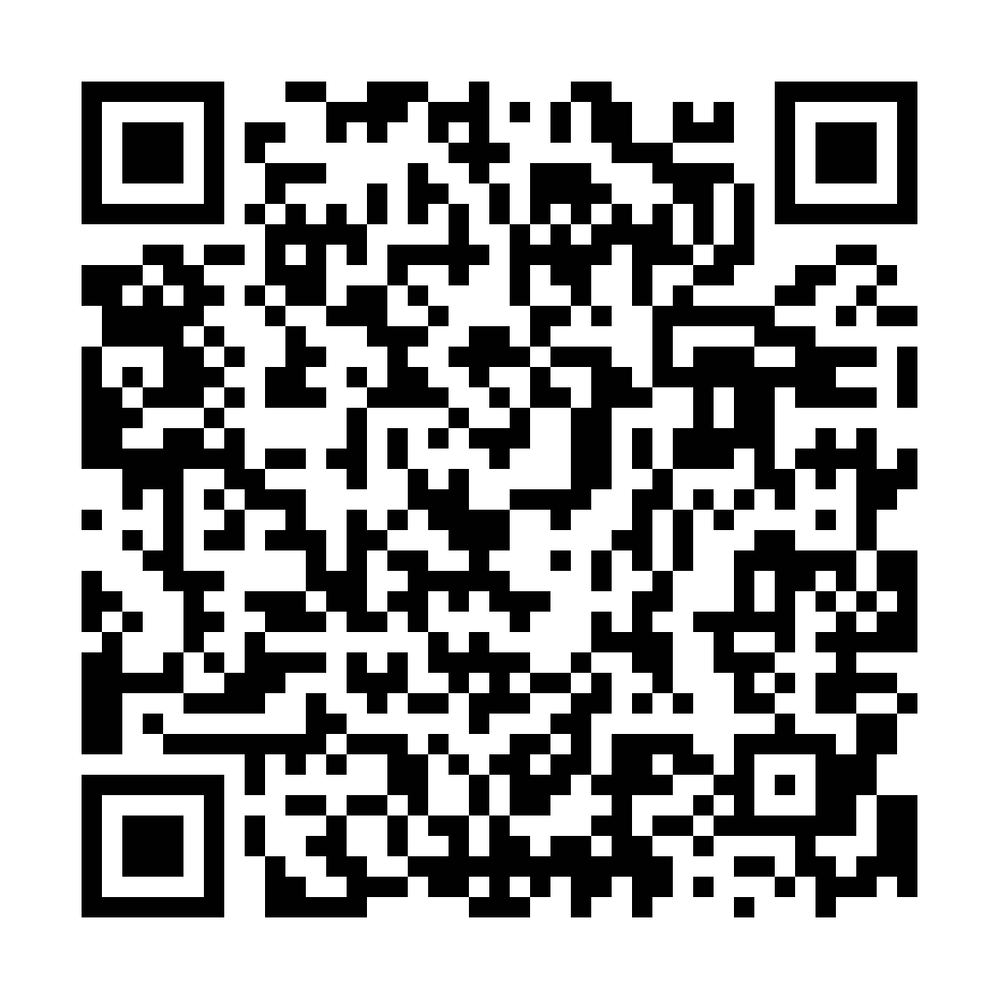

# AR Menu — proof of concept

Scan the QR code with a phone, tap **View on your table**, and a chocolate ring
cake appears on your table at its real size. Walk around it, lean in, look into
the hole.

**Live:** https://pmtchakanyuka-star.github.io/ar-menu-poc/



## How it works

| Piece | What it is |
| --- | --- |
| `index.html` | The menu-item page. Uses Google's [`<model-viewer>`](https://modelviewer.dev) for the 3D preview and the AR hand-off. `ar-scale="fixed"` locks the cake to real size. |
| `models/cake.glb` | glTF 2.0 model for the web preview and Android (WebXR in Chrome, Scene Viewer as fallback). |
| `models/cake.usdz` | USDZ model for iPhone/iPad (AR Quick Look). |
| `tools/build_cake.py` | Generates both models. |
| `tools/make_qr.py` | Generates `qr.png` / `qr.svg`. |

The model is a procedural replica built from a single photo: a white 30 cm
platter, one continuous glossy-glaze surface lathed from a hand-fitted profile
(pool in the hole → crest → flared sides → pool on the plate, with an irregular
rounded edge), and ~19,000 individual chocolate sprinkles scattered by surface
density. It uses no textures, only geometry and PBR materials, so it renders the same
in model-viewer, Scene Viewer and Quick Look. It's built in metres and Y-up, with the origin
at the plate's underside, so AR sets it straight onto the table.

| | |
| --- | --- |
| Cake | 22.4 cm across at the base, 9.4 cm tall (estimated from the photo) |
| Plate | 30 cm |
| Triangles | ~252k |
| Files | `cake.glb` 5.5 MB · `cake.usdz` 4.0 MB |

Both files are validated: the Khronos glTF Validator reports 0 errors and 0 warnings, and all 28 OpenUSD
validators pass for the USDZ (including the usdz packaging rules).

## Rebuild

```bash
python -m venv .venv
.venv/Scripts/python -m pip install -r requirements.txt   # macOS/Linux: .venv/bin/python
.venv/Scripts/python tools/build_cake.py
.venv/Scripts/python tools/make_qr.py
```

To match a real cake exactly, edit `CAKE_PROFILE`, `POOL_RADIUS` and the plate
profile in `tools/build_cake.py`, which use (radius, height) pairs in metres.

## From PoC to a real AR menu

- **Capture real dishes with photogrammetry.** Use Reality Composer or Object
  Capture on iPhone, Polycam, or Luma. Each dish then becomes a photoreal
  textured model rather than a hand-built replica, and the same page and QR flow work as-is.
- **Serve and compress models.** Use Draco or meshopt for the GLB, and a CDN.
- **One QR per table.** It opens the menu; each dish opens in AR from there.
